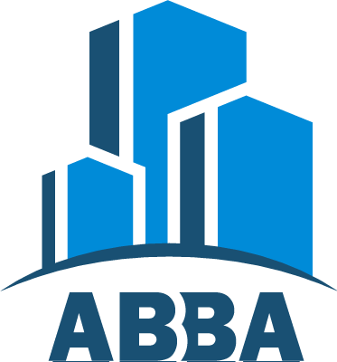

# ABBA ING & ARQ

## Información

* **Curso:** Desarrollo Web / Coderhouse

* **Comisión:** 24495

* **Profesor:** Cesar Gimenez Lascano

* **Tutor:** Jorge Schelotto

* **Desarrollado y diseñado por:** Fabio Andres Alvarez

* **Link del proyecto final:** fabio-alvarez.github.io/proyecto-coder/

## Herramientas utilizadas

### Lenguajes
* **HTML5**
* **CSS**
* **SASS**

### Framework
* **Bootstrap**

### Otros
* **Animate.css**

## Contacto

* **LinkedIn:** https://www.linkedin.com/in/fabio-andr%C3%A9s-%C3%A1lvarez-casallas/
* **GitHub:** https://github.com/Fabio-Alvarez
# PROYECTO-CODER-WEB
